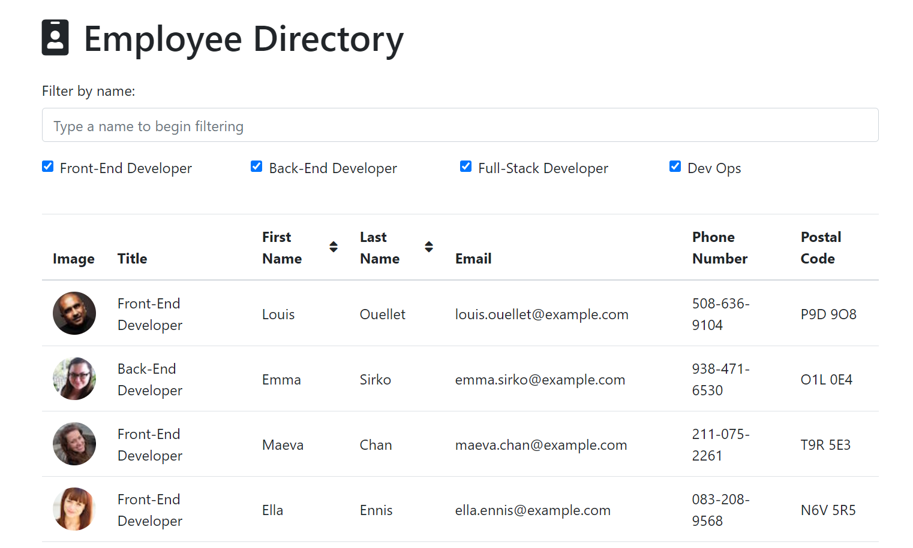
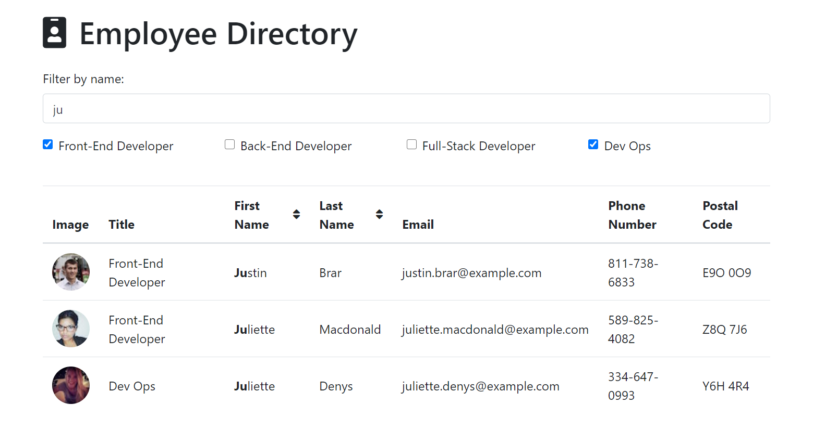
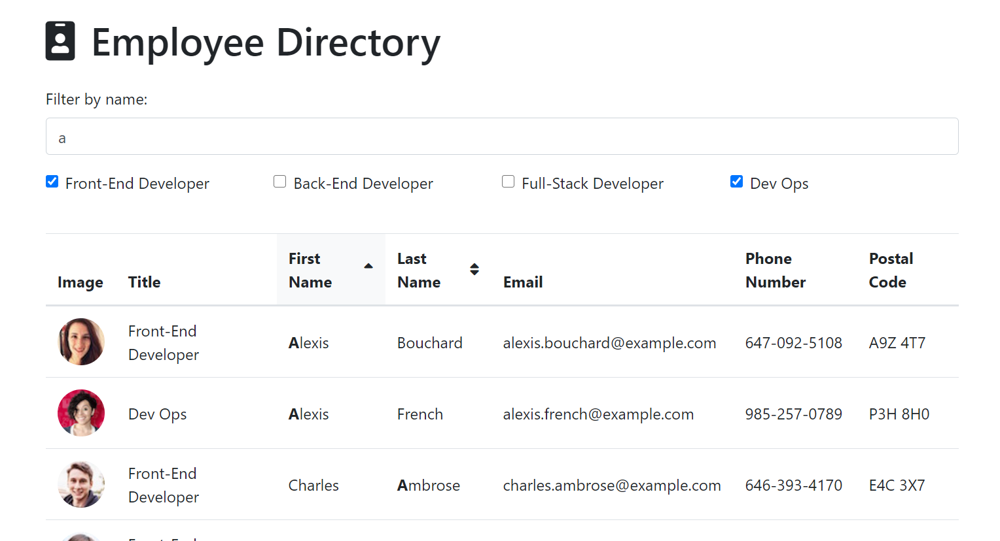

# Bootcamp - Homework 14: Employee Directory

:link: [Go lookup some employees!](https://serene-escarpment-10194.herokuapp.com/)

A sortable and filterable employee directory.

Filters include:

- Filter by name
- Filter by title

Sorting includes:

- Sort by first name
- Sort by last name

Employee information is generated by the [Random User API](https://randomuser.me/).

A user story and acceptance criteria were provided for this assignment. The goal was to create a React application that:

- Splits the UI into different components
- Manages state
- Responds to user events

## Purpose

For managers who need quick access to other employee's contact information.

## Local Installation

1. Run `npm install` before using the application locally.
2. To run the application, run `npm start`.

## Built with

- [React](https://reactjs.org/)
- [Bootstrap 4.5](https://www.npmjs.com/package/bootstrap)
- [Font Awesome 5](https://fontawesome.com/)

## License

This project is licensed under the **MIT License**.

This homework assignment is part of the [Carleton University Coding Bootcamp](https://bootcamp.carleton.ca/).
